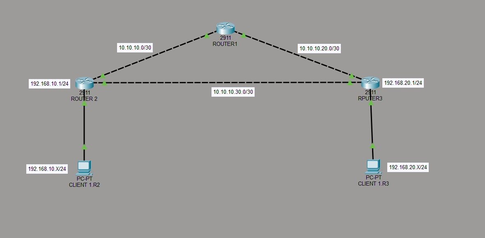

# MikroTik OSPF Routing Lab

## Overview
This project is a MikroTik routing lab simulation using OSPF dynamic routing protocol with failover and backup link implementation.

The topology simulates a small enterprise network where:
- Router1 acts as the Core/Internet Router
- Router2 acts as Branch Router 1
- Router3 acts as Branch Router 2

OSPF is used to dynamically exchange routes between routers and automatically switch traffic to the backup path when the main link fails.

---

# Features

- OSPF Dynamic Routing
- Automatic Route Learning
- Failover Backup Link
- OSPF Cost Path Selection
- Passive Interface
- Default Route Propagation
- NAT Internet Access
- DHCP Client Support
- Traceroute Testing

---

# Topology



---

# Network Design

## Main Link
- Router2 → Router1 → Router3

## Backup Link
- Router2 ↔ Router3

The backup route is configured with higher OSPF cost so traffic prefers the main route during normal operation.

If the main route fails, OSPF automatically switches traffic to the backup route.

---

# IP Addressing

| Device | Network |
|---|---|
| Client Router2 | 192.168.10.0/24 |
| Client Router3 | 192.168.20.0/24 |
| Router2 ↔ Router1 | 10.10.10.0/30 |
| Router1 ↔ Router3 | 10.10.20.0/30 |
| Router2 ↔ Router3 Backup | 10.10.30.0/30 |

---

# OSPF Configuration

## OSPF Features Used
- Router ID
- Backbone Area
- Interface Template
- Passive Interface
- OSPF Cost
- Neighbor Adjacency

---

# Failover Testing

## Normal Condition
Traffic path:
```text
Router2 → Router1 → Router3
```

## Link Failure Condition
When the main link is disconnected:
```text
Router2 → Router3
```

OSPF automatically recalculates the route and switches traffic to the backup path.

---

# Verification

## Connectivity Test
- Successful ping between clients
- Successful internet access
- Successful OSPF neighbor adjacency

## Troubleshooting Tools
- ping
- traceroute
- routing table analysis

---

# Files Included

| File | Description |
|---|---|
| routercore.rsc | Core Router Configuration |
| router1.rsc | Branch Router 1 Configuration |
| router2.rsc | Branch Router 2 Configuration |

---

# Learning Outcomes

This lab helped understand:
- Packet Flow
- Routing Logic
- OSPF Dynamic Routing
- Route Failover
- Backup Link Design
- Enterprise Network Topology
- Troubleshooting using Traceroute

---

# Author

Rendy Agus
Backend & Networking Learner
